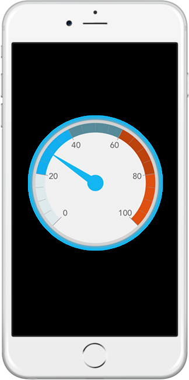
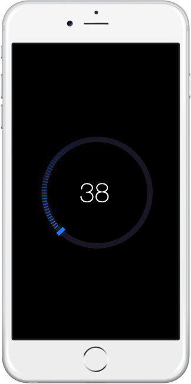
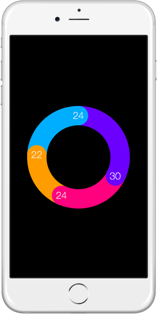
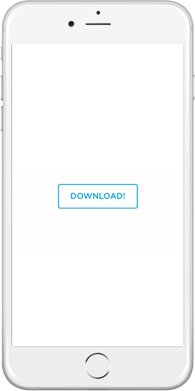

# Домашна работа №1

Всеки студент трябва да работи над визуална контрола, която трябва да е наслесдник на UIView. Решението трябва да се разработи като минимално мобилно приложение, което да показва контролата в действие. Кодът трябва да е публикуван в github репозитори и трябва да се изпрати връзка към репозиторито на следния адрес swiftfmi @ gmail.com. __Решения се приемат до 4 декември__.

 Може да намерите кой тип контрола трябва да имплементирате в таблицата долу. 

Които се чувства уверен може да се опита да имплементира контролата за напреднали вместо предварително зададената такава.

##  Правила
* Да не се използват графични ресурси.
* Рисуването да става с код или с помощна програма, която генерира криви.
* Няма да се толерира плагиатстването(копиране) на код.
* Целта на домашното е да се научим да реализираме решения, по дизайн.
* Контролите да имат подходящ интерфейс, чрез който да могат да промят своите стойности и изглед.

## Контроли
__Тип 1:__ 

* Стрелката да може да се мести по оста си.
* Скалата да може да се задава в списък с 5 елемента.
* Всеки сигмент може да има различен цвят.

__Тип 2:__ 

* Стойността да е от 0 до 100
* Скалата да отразява зададеният процент.
* Да може да се дефинира позицията на началото и края.
* Да може да смеян цвета на текста и скалата.
* Да може да сменя шаблона (разстоянието между елементите) на скалата.

__Тип 3:__  

* Да може да се определя динамично броят на сегментите (по-голям от 3).
* Всеки сегмент да може да има различен цвят.
* Сумата на стойностите да е 100.
* Да може да се определя различен цвят на текста за всеки сегмент.

__За напреднали:__

* Да може да се задава текста на бутона динамично.
* Да се задава цвета динамично.
* Да се наблегне на анимациите и плавното преминаване между тях.

## Разпределение
| ФН   |      Контрола тип |
|----------|:-------------:|
|61601|1|
|45156|2|
|71593|3|
|81531|3|
|71621|2|
|81187|1|
|81383|1|
|45111|2|
|81489|3|
|81418|3|
|71447|2|
|81568|1|
|81227|1|
|81267|2|
|81120|3|
|80685|3|
|62029|2|
|62050|1|
|62092|1|
|62103|2|
|62026|3|
|71745|3|
|81349|2|
|45018|1|
|71467|1|
|81388|2|
|45121|3|
|71584|1|
|61865|3|

## Въпроси и отговори

1. Къде да тработя, когато нямам mac? - Всеки може да остава след упражненията на своята група и да твори на воля.
2. Как да си направя github акаунт? - https://github.com/join?source=header
3. Къде да задавам други въпроси? - пишете директно на екипа swiftfmi @ gmail.com
4. Трябва ли да качвам решението в gihub преди крайната дата? - Препоръчително е да качвате всички промени, за да виждаме прогреса.
