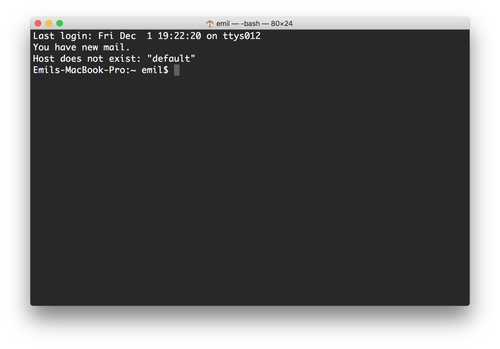
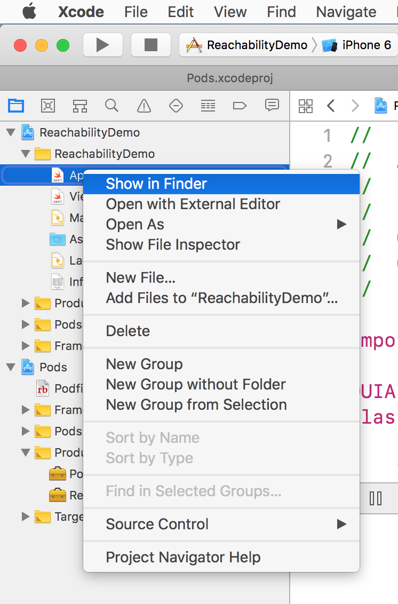
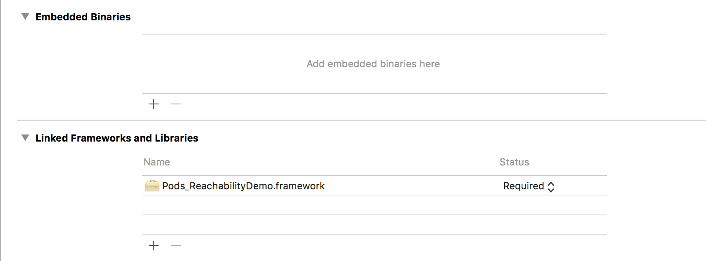

# CocoaPods

Днес ще разгледаме основен инструмент за интегриранен на външни библиотеки към iOS/macOS/tvOS/watchOS проекти. Първо ще започнем с централизирания депендънси менниджър, който е разработен на ruby. Това е CocoaPods. Можете да го инсталирате лесно на вашият mac само чрез стартирането на следната команда

	sudo gem install cocoapods
	
После ще трябва да въведете администраторската парола и инсталацията ще протече гладко, ако имате последна версия на Xcode и ruby. 

_ruby е инсталиран по подразбиране на всеки mac и идва като част от macOS_

## Как да добавим CocoaPods към вече съществуващ проект?

Трябва да отворим терминал и да навигираме до съотвeтния проект. 



Първо въвеждаме ```cd ``` в терминала. Отваряме проекта и отваряме произволен файл от него в Finder (това става с десен клик).  



После можем да завлачим синята папката към прозореца на терминала (тази която е в заглавието на Finder прозореца).


После само стартираме тази команда и вече сме се намираме в директорията на проекта (папката на проекта).

Алтернативно решение е да знаем къде се намира проекта и да навигираме с команди:

	cd име-на-директория 

и също 

	cd ..

за да се прдвижим към бащата (т.е. предходното ново).

За да инициализираме CocoaPods трябва да стартираме следната команда:

	pod init
	
Резултата от нейното изпълненеи ще е начален ```Podfile```. В този файл ще трябва да опишем всички външни проекти, които ще очакваме да станат част от нашето приложение.

Като пример ще дадем много съществен проект - ```ReachabilitySwift```, който се изпозлва за да засичаме състоянието на сързаност на устройството. 

__Може да търсите проекти директно в официалния сайт на CocoaPods [cocoapods.org](https://cocoapods.org/).__

Може да потърсите горния проект [така](https://cocoapods.org/?q=ReachabilitySwift).

За да добавим проекта трябва да променим генерирания ```Podfile``` както следва:

	# Uncomment the next line to define a global platform for your project
	platform :ios, '9.0'
	
	target 'ReachabilityDemo' do
	  # Comment the next line if you're not using Swift and don't want to use dynamic frameworks
	  use_frameworks!
	
	  # Pods for ReachabilityDemo
	    pod 'ReachabilitySwift'
	    pod 'Texture'
	end

Тук е важно да отбележим, че основният таргет в проекта се казва - ```ReachabilityDemo```. Т.е. таргет-а трябва да е част от вашия проект. Ако имате повече от един таргет, трябва да добавите зависимостите тук за всеки различен таргет.

Следващата стъпка е да добавим (инсталираме) всички депендънсита. Това става лесно с основната команда

	pod install
	
С тази команд мениджъра организра списък от всички под проекти, които искаме да станат част от нашия. Ако те самите имат други под проекти с различни версии, се търси най-правилната, която пасва. Свалят се  необходимите файлове и ресурси.
Създава се ```Podfile.lock``` в който са записани всички версии, които са свалени. 

_Трябва да добавите този файл, както и ```Podfile```-а към репозиторито си (git)._ Благодарение на този файл, другите разработчици по вашия проект ще могат да получат същите версии на външните проекти, независимо кои са последните публикувани.
 
Създава се проект ```Pods```. Този проект включва всички външни зависимости описани в ```Podfile```-a. Нашия начален проект и ```Pods``` проекта се вкарват в общ workspace, който трябва да се използва за напред. В конкретния случай:

	ReachabilityDemo.xcodeproj

Генерира се:

	ReachabilityDemo.xcworkspace

Това е workspace–а, който включва и двата проекта. ```CocoaPods``` създава всички необходими връзки между нашия проект и общия, който съдържа всички външни проекти.

Трябва да се използва само xcworkspace, за да могат да се изпозлват и новодобавените външни ресурси/класове.

В нашия случай можем да използваме модула ```Reachability```. Нека да отворим ```ViewController.swift```.

Там добавяме:

	import Reachability
	
После добавяме следните методи към класа.

	override func viewWillAppear(_ animated: Bool) {
        super.viewWillAppear(animated)
        
        //абонираме се за съобщение/известие
        NotificationCenter.default.addObserver(self, selector: #selector(reachabilityChanged(note:)), name: .reachabilityChanged, object: reachability)
        
        do{
        //старираме механизма за наблюдение
            try reachability.startNotifier()
        }catch{
            print("could not start reachability notifier")
        }
        

    }
    //обработваме съобщенията
    @objc func reachabilityChanged(note: Notification) {
        
        let reachability = note.object as! Reachability
        
        switch reachability.connection {
        case .wifi:
            print("Reachable via WiFi")
        case .cellular:
            print("Reachable via Cellular")
        case .none:
            print("Network not reachable")
        }
    }
    
    override func viewWillDisappear(_ animated: Bool) {
        super.viewWillDisappear(animated)
        //спираме механизма за наблюдение
        reachability.stopNotifier()
        //разабонираме
        NotificationCenter.default.removeObserver(self, name: .reachabilityChanged, object: reachability)
    }


Добре е да отбелеим, че може да се добавят конкретни условия за версия към външните зависимостите. Примерно, ако искаме да изтеглим конкретна версия:

	pod 'ReachabilitySwift','~> 4.1.0'

Има различни оператори, с които можем да даваме различни ограничения. Следва се следната логика:

* ~> 
* >=
* <
* директно цитиране на версия
	
[Тук](https://semver.org/) може да прочете за основната практика, как се организират версиите на продуктите по принцип.

```CocoaPods``` е достатъчно "умен" иснтрумент, който се старае да удволетвори всички зависимости. Когато той не може да се справи, ще подскаже че е необходима намеса от страна на разработчика. Т.е. ще трябва да видите и отстраните конфлика, който се е образувал от някои подзависимости на различни проекти.

В следващта секция ще разгледаме алтернативен инструмент, който се изпозлва за полу-автоматично интегриране на вънщни зависимости/проекти.

# Carthage

Това е дистрибутиран инструмент за полу-автоматично управление на зависимости. Повече може да намерите [тук](https://github.com/Carthage/Carthage).

Инструмента е децентрализиран, което означава, че работи с директни адреси на проекти и няма централно място където всички проекти да са регистрирани. Това прави откриването им, малко по-трудно. Съответно за да направите проекта си съвместим с ```Carthage``` не се изискват толкова много допълнителни усилия, както при ```CocoaPods```. 

Инструмента е полу автоматичен, защото той не интегрира автоматично депендънситата във вашия проект.

Тук файла за описване на зависимоситите се нарича ```Cartfile```. Това е текстов файл, който съдържа само списък от зависимостите.

Ето и един пример:

	github "ashleymills/Reachability.swift"

Тук имаме няколко вида източници:

* github - след него следва потребителско-име/репозитори

		github "ashleymills/Reachability.swift"
		
* git - следва адрес на репозиторито 

		git "https://enterprise.local/desktop/git-error-translations2.git"
		
* binary - следва адрес на описващ файл

		binary "https://domain.com/release/MyFramework.json"
		
Правилата за версиите пак са подобни:

* >= 1.0  версия 1.0 или по-висока
* ~> 1.0 версия съвместима с версия 1.0
* == 1.0 точно версия 1.0
* "some-branch-or-tag-or-commit" за специален бранч, таг или къмит в Git 
    _Това не се поддържа за ```binary```_

След като сте записали необходимите данни в ```Cartfile``` може да извикате 

	carthage update

И това ще задейсва процеса по сваляне и пакетиране на проектите. Финалния резултат ще са няколко ```.framework``` файла. Тези зависимости трябва да се добавят ръчно към проекта. Това става като добавите файловете към следните две секции:

* ```Embedded Binaries```
* ```Linked Frameworks and Libraries```

 

```Carthage``` ще произведе версии за различните операциаонни системи. В зависимост от вапия проект е добре да генерирате само тези които са нужни. Трябва да добавите само тези, които са за вашата операционна система.

Трябва да отбелижм, че е възможно е да миксираме зависимости от двата мениджъра, с които се запознахме. Това ни дава ниво на свобода, но ни поставя в трудна ситуация, ако се изпозлват библиотеки, които имат общи зависимости (под проекти) но изискване за различни версии. Когато има класовес еднакви имена компилацията на Swift код-а няма да завърши правилно и ще получите грешка. Трябва да отстраните грешката ръчно.

# Общи съвети при разработката на софтуер

1. Първо проверете дали няма нещо вече написано, на което можете да базирате работата си.
2. Не забравяйте да проверите лицензите! Те трябва да ви позлволяват това което е нужно.
3. Когато разработвате решение, може да изпозлвате външни библиотеки в процеса на прототипизиране и после да пренапишете тези части, които не отговарят на вашите изисквания.
4. Презипозлването на външни библиотеки позволява да създавате софтуер бързо и с малко усилия. 
5. Добре е да знаете как може да поправяте грешки в чужд код, за да може да базирате работата си на външни библиотеки. Когато те не работят, тогава ще трябва да се гмурнете по на дълбоко и да оправите тези проблеми. 
6. Не забравяйте, че всички разработчици образуват общество и споделянето на знание в това общестово го тласка напред.