# UIStackView

### При разработването на iOS приложения често се сблъскваме с два сценария:
* Промяна в дизайна изисква да добавим или махнем елемент от екрана, докато нашето приложение работи
* Трябва да позиционираме няколко елемента един спрямо друг

Да добавим IBOutlet за всеки constraint, за да можем да ги активираме и деактивираме? Външна библиотека? Ако е прекалено сложно да се направи в Interface Builder, може да решим да направим всичко с код. А ако искаме да добавим само още един елемент, няма ли да счупим сложната йерархия в сториборда?

### Често ли ви се случва да зачистите всички constraint-и и да започнете отново, защото всичко се чупи?

С UIStackView решението често е тривиално.

### Какво е UIStackView
* UIView subclass (естествено), който е наличен от iOS9
* Дефинира правила за подреждането и разпределението на своите поделементи
* Не използваме addSubview: или removeSubView:, ако искаме то да се грижи за подредбата
* Вместо това използваме addArrangedSubview: и removeArrangedSubview: а неговите поделементи достъпваме с arrangedSubviews
* Толкова популярно, че има свой собствен бутон в XCode - "Embed in Stack"
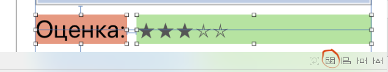

### По-важни пропъртита
* axis: UILayoutConstraintAxis
	* horizontal
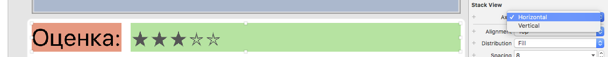
	* vertical

* alignmend: UIStackViewAlignment
	* fill
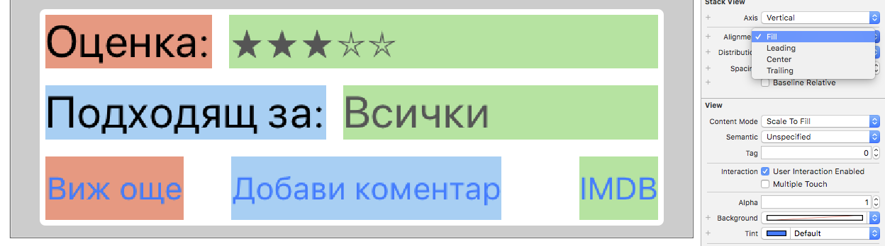
	* leading
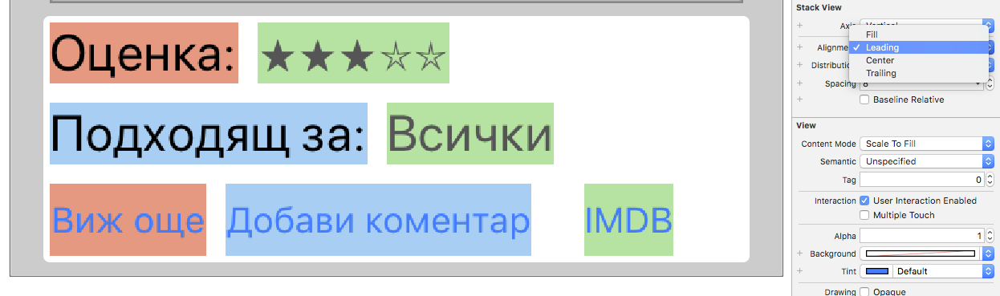
	* center
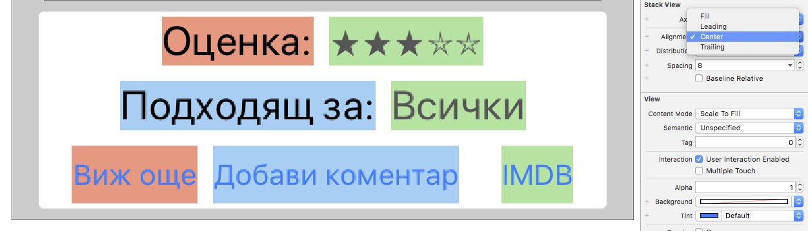
	* trailing
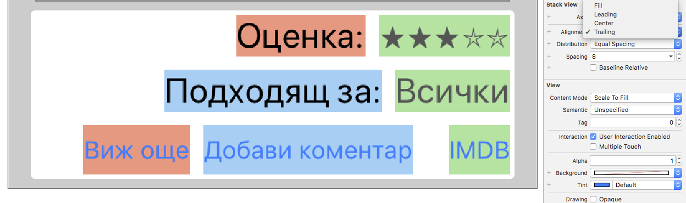
* distribution: UIStackViewDistribution
	* fill
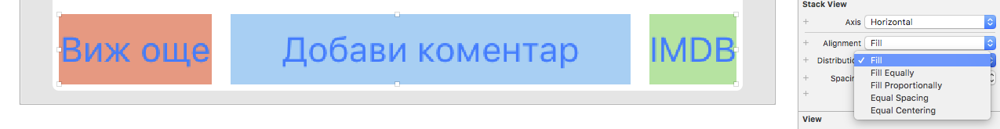
	* fillEqually
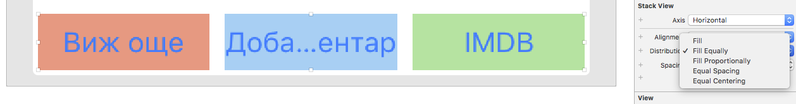
	* fillProportionally
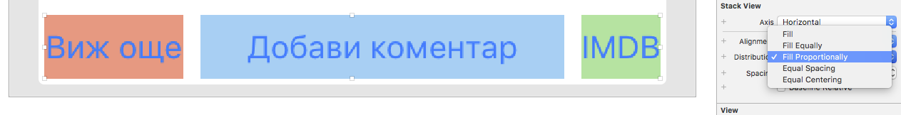
	* equalSpacing
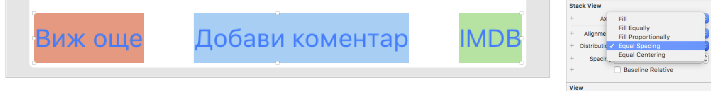
	* equalCentering
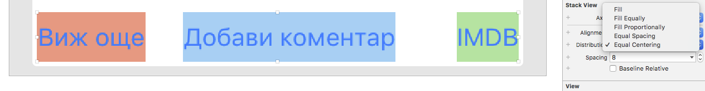
* spacing: CGFloat - разстоянието между елементите

### Demo:
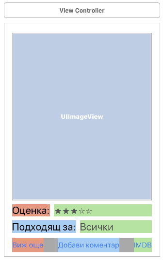

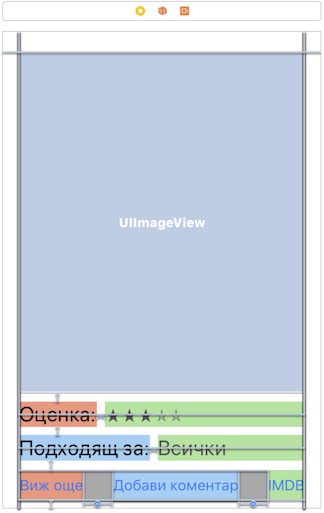
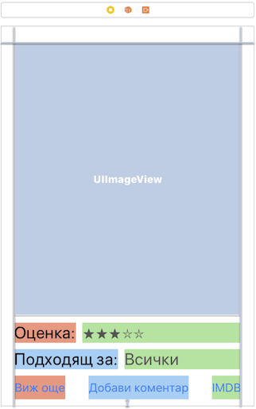
   

# Size classes demo: