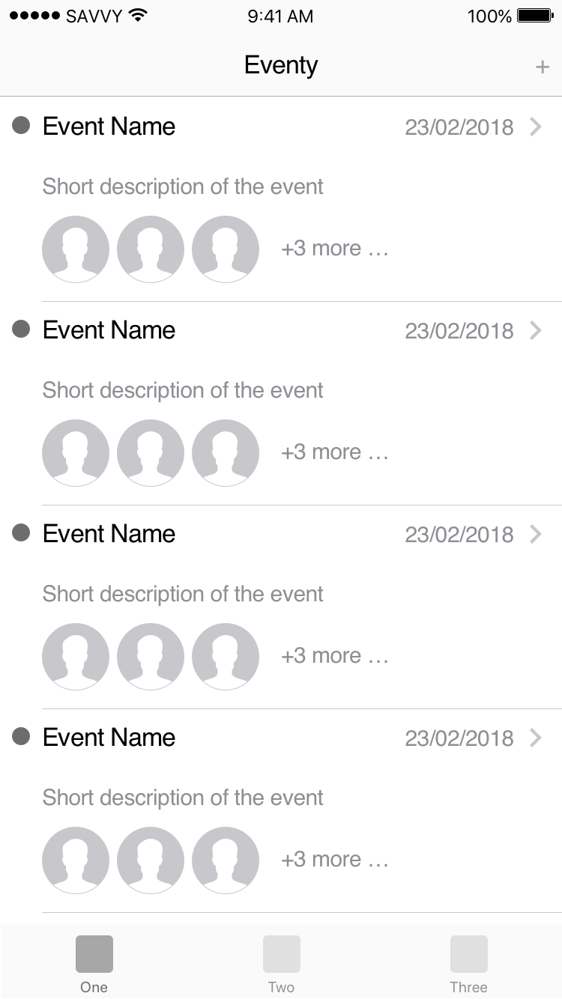
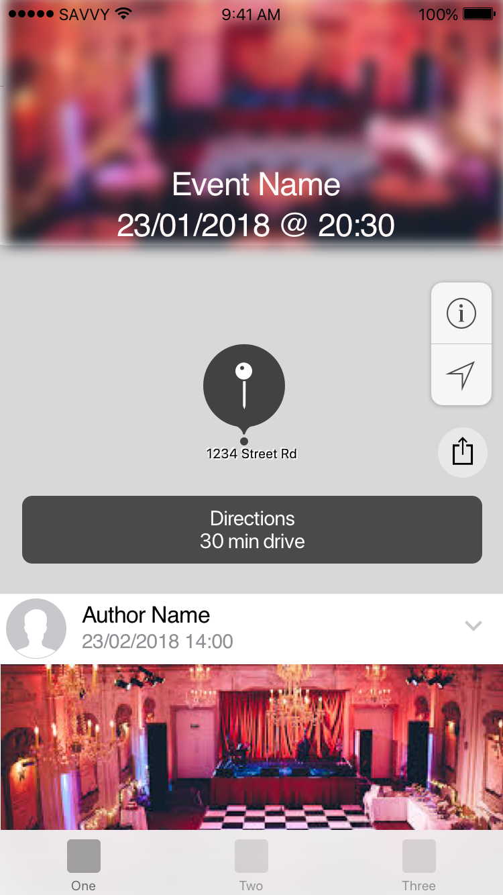
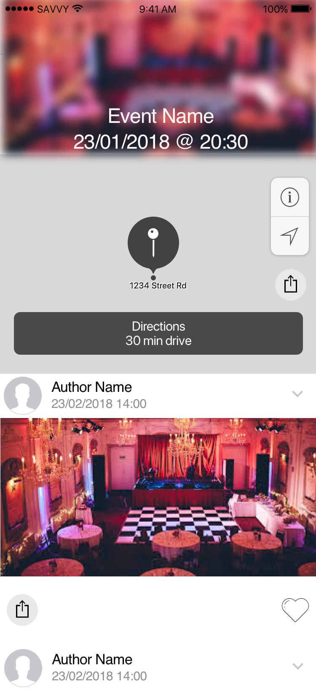
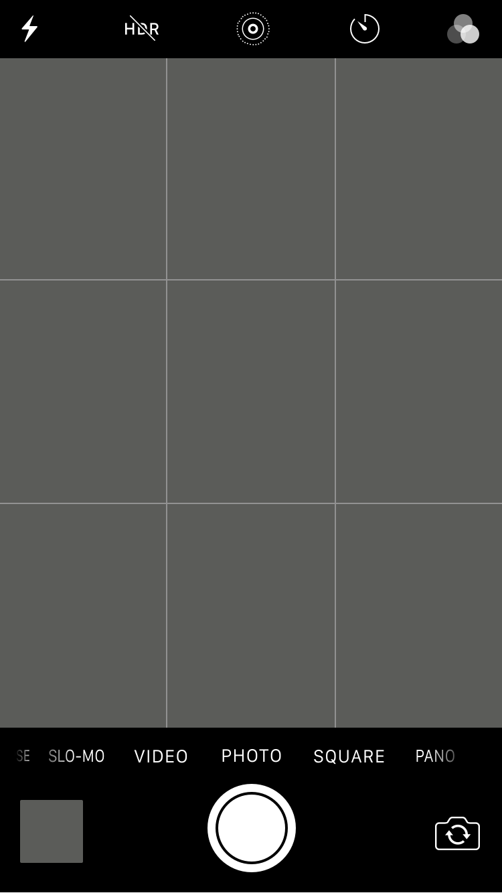
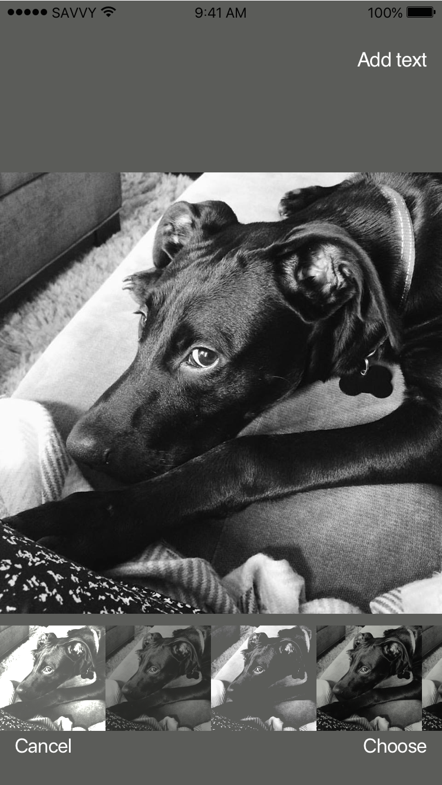
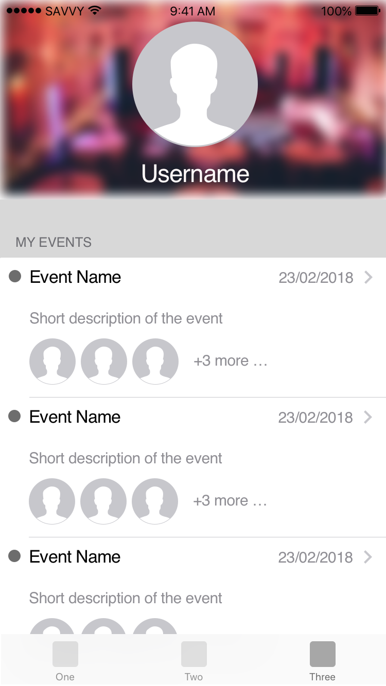

# Информация за проекта - Eventy

Прокета трябва да да реализира мобилно приложение, което да следва следните екрани.

Това е основен екран, който представя списък с публичните събития. Потребителя не трябва да се логва в системата за да има достъп.

Ако събититето е публично, потребителя може да има достъп.
Ако събитието е частно, тогава потребителя трябва да е ауторизиран в системата.

!Вход трябва да се осъшестви в най-късния възможен момент в системата. Т.е. непосредствено преди действие, което изисква потребител - като качване на снимка, присъединяване към събитие, т.н.

!Да се добави възможност за качване на снимка към събитие - от глаерията или от камерата.

Това е екрана, който показва, че списъка със снимки асоциирани с ивента може да се скролира. Всяка снимка може да се репортва за неприлично съдържание.

Екран, който позволява заснемането на снимка, която се добавя към определен ивент.
 

Екран с възможност за добавяне на филтър на снимка или текст/емоджита.

Екран представяш профила на потребител. Позволява качването на снимка(аватар). Предлага бърз достъп до всички събития, в които участва потребителя.

## API 

За момента API е в разработка. Кодът може да намерите на следния [адрес](https://github.com/SwiftFMI/Eventy-backend).

