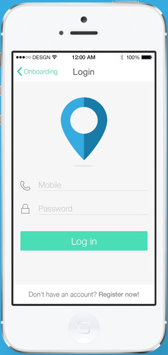

#  Задача - Login screen

Да се направи Login екран, който има поне две полета (потребителско име и парола) и един бутон (login). Да се стилизира екрана, така че да изглежда приятно за потребителя.

Ето няколко примера:

Да се отпечатват данните в конзолата при натискане на бутона.

Да се показват съобщения за грешка, ако някое от полетата не съответства на зададените критерии.
    - ако потребителското име е e-mail, трябва да съдържа "@" ( или пълна валидация с [RegEx](http://benscheirman.com/2014/06/regex-in-swift/) )
    - да се проверява за минимална дължина на паролата (8 символа) и наличието на число и главна буква

Да се подобри въвеждането на данни чрез софтуерната клавитура.
    - да може да се преминава от едното поле към другото с `return`
    - да може да се активира бутона с натискане на `return`
