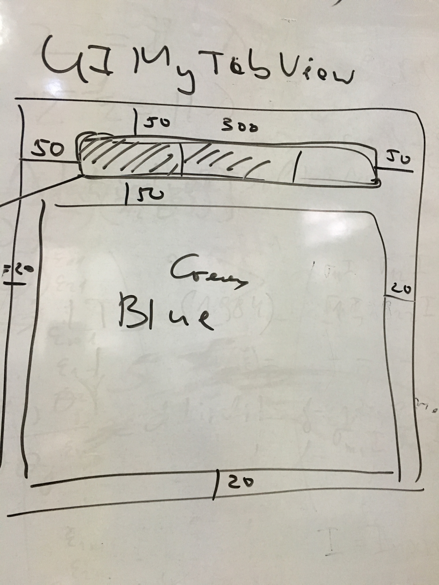
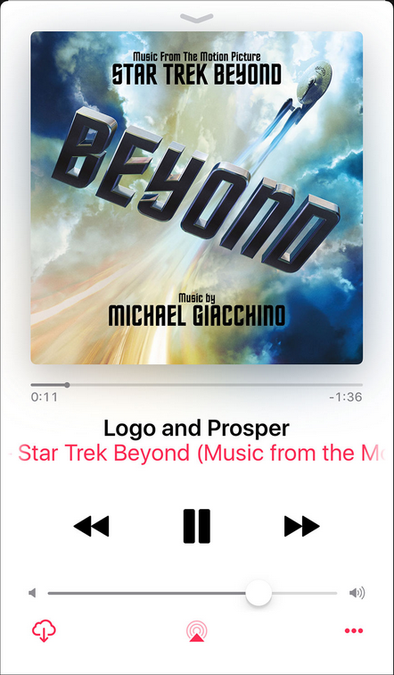
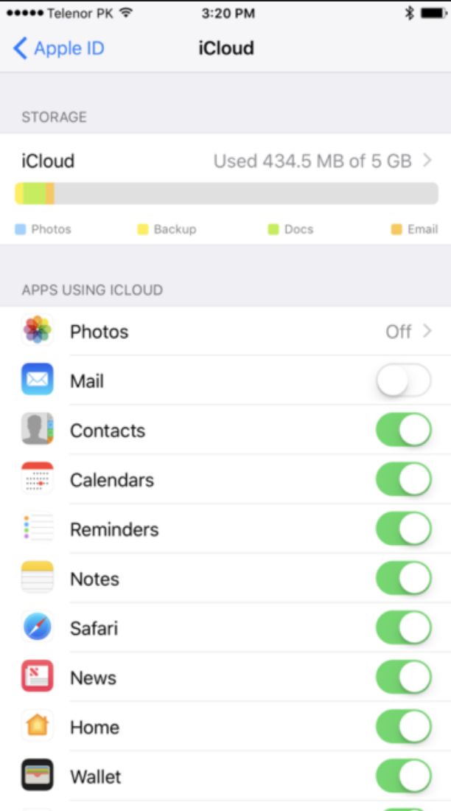
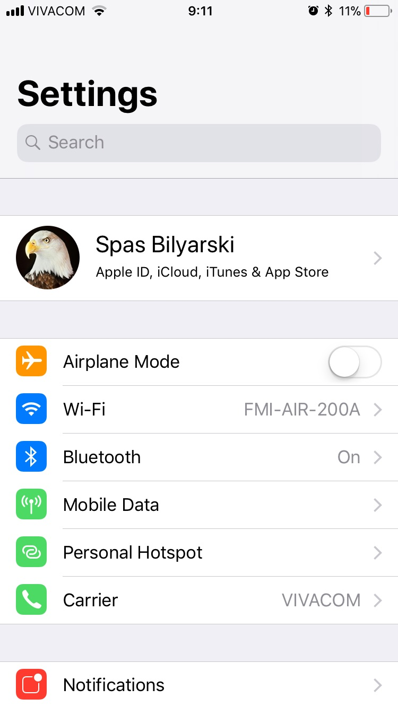

# Задачи за упражнение 28.10.2017

1. Да се имплементира наследник на UIView, който се казва MyTabView.

2. Да се импементрат следните няколко екрана, като се използват подходящите контроли/view-та.

	`За колона #1`
	
	

	`За колона #2`
	
	

	`За колона #3`
	
	

	`По-сложен UI за напреднали (по избор):`
	
	
	`или`
	

3. Да се добави модел към задача 2, така че да се спази принципа на MVC. (Да се изберат подходящи елементи, които да реагират на промени в модела. Моделът да се сменя при настискане на отделен бутон.)

